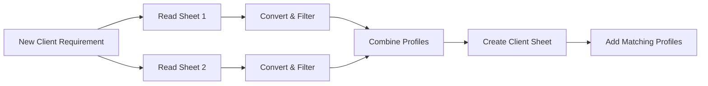

> ⚡ Built this to eliminate 5+ hours of manual influencer filtering every week
>
> # 🚀 Instagram Profile Matcher (n8n Workflow)

> Automatically match the **perfect influencers** for your brand in seconds — not hours.

---


## 🔥 What This Workflow Does

This **fully automated n8n workflow**:

* 📥 Captures **new client requirements** from Google Sheets
* 🔍 Filters influencer profiles from multiple sheets
* 🧠 Applies **smart matching logic (followers, gender, location)**
* 📊 Creates a **brand-specific output sheet**
* ⚡ Delivers ready-to-use influencer lists instantly

---

## 🎯 Real Use Case

Imagine this:

👉 A brand submits:

* Gender: Female
* Location: Delhi
* Followers: 10K – 100K

💥 This workflow:

* Scans **multiple databases**
* Converts messy values like `10k`, `2.5M`, `1L`
* Filters only **relevant profiles**
* Generates a **clean sheet with matching influencers**

---

## ⚙️ Workflow Architecture



---

## 🧠 Smart Logic Inside

### ✅ Follower Normalization

Handles real-world messy data:

* `10k` → 10,000
* `2.5M` → 2,500,000
* `1L` → 100,000

### ✅ Range Filtering

Applies:

```
Min Followers <= Profile <= Max Followers
```

### ✅ Multi-source Matching

* Combines data from **multiple sheets**
* Supports scalable influencer databases

---

## 📂 Nodes Breakdown

### 🟢 Trigger

* **Received new client requirement**
* Watches Google Sheet for new entries

### 📊 Data Sources

* **Read Source Sheet 1**
* **Read Source Sheet 2**

### 🔄 Processing

* **Convert and Filter Sheet 1**
* **Convert and Filter Sheet 2**
* Cleans + filters follower counts

### 🧩 Aggregation

* **Combine All Profiles**

### 📤 Output

* **Create Client Sheet**
* **Add Matching Profiles**

---

## 🚀 How to Use

1. Import the workflow into n8n
2. Connect your Google Sheets credentials
3. Update:

   * Source sheet IDs
   * Column names (if needed)
4. Add a new row in your **Client Requirements sheet**
5. Watch the magic happen ✨

---

## ⚠️ Important Notes

* Ensure follower column may contain:

  * `10k`, `5M`, `1L`, or raw numbers
* Workflow already normalizes these values
* Matching logic is customizable in:

  * `Combine All Profiles` node

---

## 🛠 Customization Ideas

* 🎯 Add niche/category filtering
* 💰 Budget-based filtering
* 📈 Engagement rate scoring
* 🤖 AI-based influencer ranking

---

## 💡 Why This is Powerful

* ❌ No manual filtering
* ❌ No Excel headaches
* ❌ No data inconsistencies

✅ Fully automated
✅ Scalable
✅ Production-ready

---

## 📌 Future Improvements

* Add CRM integration
* Auto-email results to clients
* Dashboard for campaign tracking

---

## ⭐ If You Like This

Give it a ⭐ on GitHub — it helps a lot!

---

## 🤝 Need Help?

If you want:

* Advanced matching logic
* AI integration

Feel free to reach out 🚀
